# 🚀 N0MAD GitHub Actions Workflows

This document describes the automated workflows for the N0MAD project.

## 📋 Overview

N0MAD uses GitHub Actions for continuous integration, automatic versioning, and deployment to PyPI. The workflows are designed to maintain high code quality and automate the release process.

## 🔄 Workflows

### 1. 🚀 Release and Deploy to PyPI (`release.yml`)

**Trigger**: Push to `master` branch (when source code changes)

**Purpose**: Automatically bump patch version and deploy to PyPI

**Process**:
1. 🔍 **Version Detection**: Reads current version from `pyproject.toml`
2. ⬆️ **Patch Bump**: Increments patch version (e.g., 0.0.1 → 0.0.2)
3. 📝 **File Updates**: Updates version in:
   - `pyproject.toml`
   - `src/__init__.py`
   - `src/entry/main.py` (CLI version string)
4. 🏗️ **Build**: Creates wheel and source distributions
5. 🧪 **Test**: Installs and tests the package
6. 📝 **Commit**: Commits version changes to master
7. 🏷️ **Tag**: Creates git tag (e.g., `v0.0.2`)
8. 📋 **Changelog**: Generates release notes from commits
9. 🎉 **Release**: Creates GitHub release
10. 📤 **Deploy**: Uploads to PyPI using `PYPI_API_TOKEN`

**Requirements**:
- `PYPI_API_TOKEN` secret must be configured
- Push to master with changes in `src/`, `pyproject.toml`, or `setup.py`

### 2. 🧪 CI Tests (`ci.yml`)

**Trigger**: Push to `master`/`develop` or Pull Request to `master`

**Purpose**: Run comprehensive tests across Python versions

**Process**:
1. 🐍 **Matrix Testing**: Tests on Python 3.8, 3.9, 3.10, 3.11, 3.12
2. 🔍 **Linting**: Flake8 code quality checks
3. 🎨 **Formatting**: Black code formatting validation
4. 📏 **Import Sorting**: isort import organization check
5. 🔬 **Type Checking**: MyPy static type analysis
6. 🧪 **Unit Tests**: Pytest test suite execution
7. 🔒 **Security**: Bandit security vulnerability scan
8. 📋 **Package Build**: Validates package can be built and installed
9. ✅ **CLI Testing**: Tests basic CLI commands

### 3. 🎯 Manual Release (`manual-release.yml`)

**Trigger**: Manual workflow dispatch

**Purpose**: Create controlled releases with custom version bumps

**Options**:
- **Version Type**: Choose between `patch`, `minor`, or `major`
- **Pre-release**: Option to create pre-release (won't deploy to PyPI)

**Process**:
1. 🔍 **Version Detection**: Reads current version
2. ⬆️ **Custom Bump**: Increments version based on selection:
   - **Patch**: 1.2.3 → 1.2.4
   - **Minor**: 1.2.3 → 1.3.0
   - **Major**: 1.2.3 → 2.0.0
3. 📝 **File Updates**: Updates all version references
4. 🏗️ **Build & Test**: Creates and validates package
5. 📝 **Commit**: Commits with release type in message
6. 🏷️ **Tag**: Creates descriptive git tag
7. 🎉 **Release**: Creates GitHub release (pre-release if selected)
8. 📤 **Deploy**: Uploads to PyPI (only for non-pre-releases)

## 🔧 Configuration

### Required Secrets

1. **PYPI_API_TOKEN**: PyPI API token for package deployment
   - Go to [PyPI Account Settings](https://pypi.org/manage/account/)
   - Create API token with scope for the `n0mad` project
   - Add to GitHub repository secrets

### Workflow Permissions

The workflows require:
- `contents: write` - For creating tags and commits
- `pull-requests: write` - For PR interactions

## 📦 Deployment Flow

```mermaid
graph TD
    A[Push to Master] --> B[Detect Changes]
    B --> C[Bump Patch Version]
    C --> D[Update Files]
    D --> E[Build Package]
    E --> F[Run Tests]
    F --> G[Commit Changes]
    G --> H[Create Tag]
    H --> I[Create Release]
    I --> J[Deploy to PyPI]
    J --> K[✅ Available: pip install n0mad]
```



## 🎯 Usage Examples

### Automatic Release (Recommended)
```bash
# Make changes to source code
git add src/
git commit -m "feat: add new autonomous development feature"
git push origin master

# 🚀 Workflow automatically:
# - Bumps version to next patch (e.g., 0.0.1 → 0.0.2)
# - Creates release and deploys to PyPI
```

### Manual Release
1. Go to GitHub Actions tab
2. Select "🎯 Manual Release"
3. Click "Run workflow"
4. Choose:
   - **Version type**: patch/minor/major
   - **Pre-release**: true/false
5. Click "Run workflow"

### Installation After Release
```bash
# Users can install the latest version
pip install n0mad

# Or specific version
pip install n0mad==0.0.2
```

## 🔍 Monitoring

### Release Status
- Check [GitHub Releases](https://github.com/ddcodepl/n0mad/releases) for latest versions
- Monitor [GitHub Actions](https://github.com/ddcodepl/n0mad/actions) for workflow status
- View package on [PyPI](https://pypi.org/project/n0mad/)

### Troubleshooting

#### Failed PyPI Deployment
1. Verify `PYPI_API_TOKEN` secret is correctly set
2. Check token has permissions for `n0mad` package
3. Ensure version doesn't already exist on PyPI

#### Version Bump Issues
1. Check `pyproject.toml` has valid version format
2. Ensure all version references are correctly updated
3. Verify git permissions for pushing tags

#### Test Failures
1. Review CI logs for specific failure points
2. Test locally with same Python version
3. Check dependencies and import issues

## 📈 Versioning Strategy

N0MAD follows [Semantic Versioning](https://semver.org/):

- **MAJOR** (X.0.0): Breaking changes, API incompatibility
- **MINOR** (0.X.0): New features, backwards compatible
- **PATCH** (0.0.X): Bug fixes, backwards compatible

### Automatic vs Manual

- **Automatic** (push to master): Always patch bumps for routine updates
- **Manual**: Choose appropriate semantic version for planned releases

## 🚦 Best Practices

1. **Use automatic releases** for regular development and bug fixes
2. **Use manual releases** for:
   - Feature releases (minor version bumps)
   - Breaking changes (major version bumps)
   - Release candidates (pre-releases)

3. **Test locally** before pushing to master
4. **Write clear commit messages** for better release notes
5. **Review generated changelogs** in GitHub releases

---

*This workflow setup ensures N0MAD maintains high quality while providing seamless automated releases to PyPI.*
